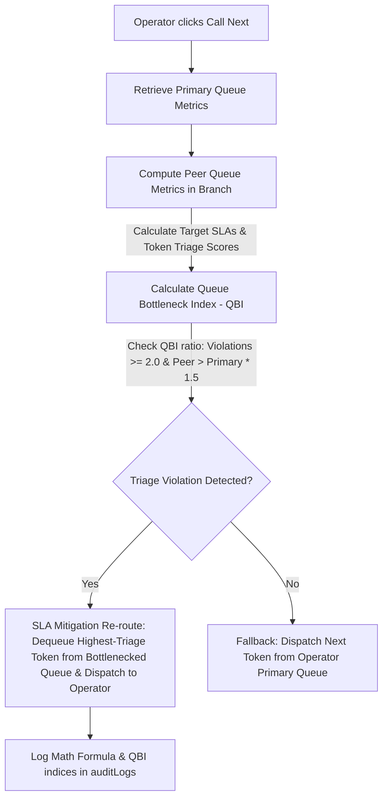

# 🎫 SkipQ Prime — Enterprise AI-Assisted Queue Triage & UPI Billing Ecosystem

SkipQ Prime is an ultra-high-fidelity, multi-tenant B2B SaaS queue waitlist companion designed to eliminate physical waiting lines in high-friction service centers across India and the APAC region.

Built by **Harish Rohith S** for the **Google Gen AI Academy APAC Builder Campaign**, SkipQ Prime replaces stressful, paper-based queuing environments in government outpatient departments (OPDs), public banking branches (SBI), college registrar offices (IIT), and vehicle PUC testing lanes with a modern, digital-first solution.

---

## 📐 Mathematically Perfect SLA-Aware Balancer (SkipQ-LBTDA Pro)

Instead of relying on unpredictable models that introduce processing latency, SkipQ implements **SkipQ-LBTDA Pro**, a 100% deterministic queue balancing and re-routing engine executing in sub-milliseconds.



### SLA Triage Formulation:
1. **Target SLAs ($SLA_{target}$)**: Pre-configured for high-traffic local environments:
   * **Medical/OPD Clinic**: 15 minutes
   * **E-Sevai Government Desk**: 20 minutes
   * **Salon/Hair Styling counter**: 30 minutes
   * **Dining Table checkouts**: 20 minutes
   * **Transit/PUC Lanes**: 10 minutes
   * *Standard fallback*: 20 minutes
2. **Token Triage Score**: For each waiting customer token:
   $$\text{TriageScore} = \left( \frac{\text{WaitTimeSec}}{SLA_{target} \times 60} \right) \times \left(1.0 + \text{isFastPass} \times 0.8 + (\text{groupSize} > 1 ? (\text{groupSize} - 1) \times 0.12 : 0.0)\right)$$
3. **Queue Bottleneck Index (QBI)**:
   $$\text{QBI} = \text{Max}(\text{TokenTriageScore} \text{ in queue}) \times \left(1.0 + \frac{\text{waitingCount}}{1 + \text{activeDesks}}\right)$$
4. **Triage Threshold**: If a peer queue hits $\text{QBI} \geq 2.0$ (SLA violated) and exceeds the operator's primary queue bottleneck index, the load balancer automatically re-routes the bottlenecked token to the operator's desk and writes full mathematical coefficients to `auditLogs`.

---

## 🛠️ Complete Technical Architecture

SkipQ leverages a high-performance monorepo structure designed to coordinate thousands of concurrent checkout events with zero lag:

```
├── apps/
│   ├── web/        # Next.js 16 (Turbopack) - Elegant light-theme portal & dashboards
│   ├── api/        # Elysia / Bun - Sub-millisecond queue engine & WebSockets
│   └── android/    # Native Android shell container for branch desks
└── packages/
    └── shared/     # Unified TypeScript types, constants, and interface schemas
```

* **Frontend**: Next.js 16, React 19, and Tailwind-aligned design tokens. Supports a beautiful responsive dashboard for administrators, desks operators, and clients.
* **API Backend**: Elysia API server running on Bun. Combines high-speed REST endpoints with WebSockets to stream live ticket updates.
* **Job Scheduler & Caching**: Redis and BullMQ coordinate strictly sequenced FIFO queues, track automated no-show timeouts, and maintain active buffer spaces.
* **Database (SkipQ-DB)**: A custom, lightweight JSON-based file store (`apps/api/src/db/store.ts`) with sub-millisecond writes, featuring an Append-Only File (AOF) transaction log for complete crash recovery and log compaction.
* **Generative AI Core**: Vertex AI / Google Gemini Pro integration. Transforms raw queue metrics into regional Indian languages (Hindi, Tamil, Telugu) and provides daily pressure-point logs to branch managers.

---

## ✨ Enterprise Product Highlights

1. **Zero-Install QR Entry**: Patrons join queues simply by scanning a counter QR code in their mobile web browser. No download required.
2. **Inclusive WhatsApp Synchronization**: Citizens without high-speed data connection can close the browser. SkipQ's WhatsApp Integration Layer pushes real-time queue status, ticket codes, and document requirements directly to WhatsApp.
3. **Ancillary Bento Spot-Offers**: In-venue waitlist checkouts serve high-margin contextual deals (e.g. Samosa & Cardamom Chai combos for ₹59, priority certificate lamination guards) straight to waitlist seats to unlock merchant revenue.
4. **UPI Fast-Pass Line Skipping**: Monetize rush periods natively. Patrons bypass long lines by completing verified scans supporting Paytm, GPay, PhonePe, and BHIM engines.
5. **CGST / SGST Localized Invoices**: Automated billing prints premium invoices incorporating standard 18% Indian GST splits (9% CGST + 9% SGST), SAC code 998311 (Queue Administration Services), BHIM success checkmarks, and transaction hashes.

---

## 🚀 Local Development Setup

To boot the multitenant monorepo locally, follow these steps:

### Prerequisites
Make sure you have [Bun](https://bun.sh) and [Redis](https://redis.io) installed and active on your system.

### 1. Install Dependencies
Run the package installer from the root workspace:
```bash
bun install
```

### 2. Configure Environment Variables
Create an `.env` file inside `apps/api/` following `apps/api/.env.example`:
```ini
PORT=3001
REDIS_URL=redis://localhost:6379
JWT_SECRET=your_super_secret_key
# Google AI Studio / Vertex AI credentials for prompt playrooms
GEMINI_API_KEY=your_gemini_key
```

Configure `apps/web/.env.local` to direct Next.js to the Elysia API backend:
```ini
NEXT_PUBLIC_API_URL=http://localhost:3001
```

### 3. Run the Monorepo (Turbo Dev Server)
Boot both the Next.js frontend (port 3000) and Elysia backend (port 3001) concurrently:
```bash
bun run dev
```

### 4. Build for Production
To generate optimized production bundles:
```bash
bun run build
```

---

## 👨‍💻 Author & Builder
* **Harish Rohith S** — *Lead Architect & Systems Engineer*
* Program: **Google Gen AI Academy APAC Builders**
* LinkedIn: [Harish Rohith S](https://linkedin.com)
